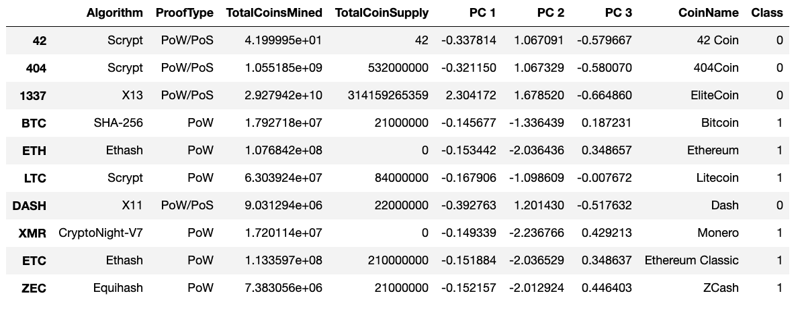

Perform machine learning using unsupervised algorithms. Work primarily with the K-means algorithm, the main unsupervised algorithm that groups similar data into clusters. Build on this by speeding up the process using principal component analysis (PCA), which employs many different features.

### Overview of the statistical analysis:

Using the following skills: unsupervised learning, how to process data, how to cluster, how to reduce your dimensions, and how to reduce the principal components using PCA. All of these skills will be used by creating an analysis for the clients who are preparing to get into the cryptocurrency market.

Martha is a senior manager for the Advisory Services Team at Accountability Accounting, oand one of the most important clients. Accountability Accounting, a prominent investment bank, is interested in offering a new cryptocurrency investment portfolio for its customers. The company, however, is lost in the vast universe of cryptocurrencies. They’ve asked to create a report that includes what cryptocurrencies are on the trading market and how they could be grouped to create a classification system for this new investment.

In this challenge, four technical analysis deliverables are required:

- Deliverable 1: *Preprocessing the Data for PCA*

- Deliverable 2: *Reducing Data Dimensions Using PCA*

- Deliverable 3: *Clustering Cryptocurrencies Using K-means*

- Deliverable 4: *Visualizing Cryptocurrencies Results*

### Results:

The script can be access via the link below:

[Link to the Crypto Clustering.ipynb](https://github.com/jsaltmd/Cryptocurrencies/blob/main/crypto_clustering.ipynb)

**Deliverable 1:** Preprocessing the Data for PCA:

Summary: *Using Pandas, the dataset is preprocessed in order to perform PCA in Deliverable 2.* 

**Preprocessed Dataset:**

**Standardized data:**

**Deliverable 2:** Reducing Data Dimensions Using PCA:

Summary: *Using Principal Component Analysis (PCA) algorithm, the dimensions of the X DataFrame is reduced to three principal components and place these dimensions in a new DataFrame.*

**Three Principal Components DataFrame:**

**Deliverable 3:** Clustering Cryptocurrencies Using K-means:

Summary: *Using K-means algorithm, an elbow curve is created using hvPlot to find the best value for K from the pcs_df DataFrame created in Deliverable 2. Then, the K-means algorithm is ran to predict the K clusters for the cryptocurrencies’ data.*

**Elbow curve:**

**Clustered DataFrame:**

**Deliverable 4:** Visualizing Cryptocurrencies Results:

Summary: *Creating scatter plots with Plotly Express and hvplot, the distinct groups that correspond to the three principal components created in Deliverable 2 are visualized, then a table is created with all the currently tradable cryptocurrencies using the hvplot.table() function.*

**Scatter Plot:**

